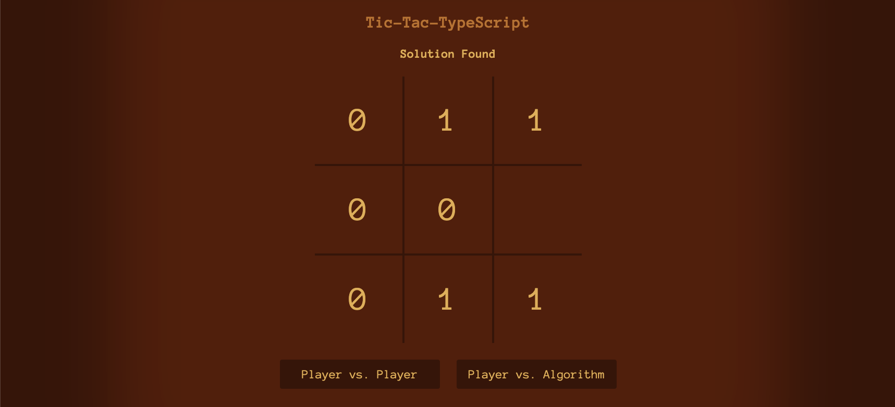

## [Tic-Tac-TypeScript](https://t-t-typescript.netlify.app/)

*Tic-Tac-TypeScript* is a retro twist on the classic game and features two game modes, allowing you to play against a fellow player or against the algorithm.

The algorithm is influenced by the Minimax algorithm, although it is not intended to solve the game and prevent the player from winning. For each move the player makes, the algorithm utilizes recusion as a means of simulating every possible future game instance, adding to a particular move's efficacy if the instance results in a win for the algorithm, and subtrating if the instance results in a loss. However, the algorithm does not use a multiplier for a particular move resulting in a win quicker than another, and therefore, allows the player to win in a number of scenarios.

## [Play the game here](https://t-t-typescript.netlify.app/)

## Technologies Used

